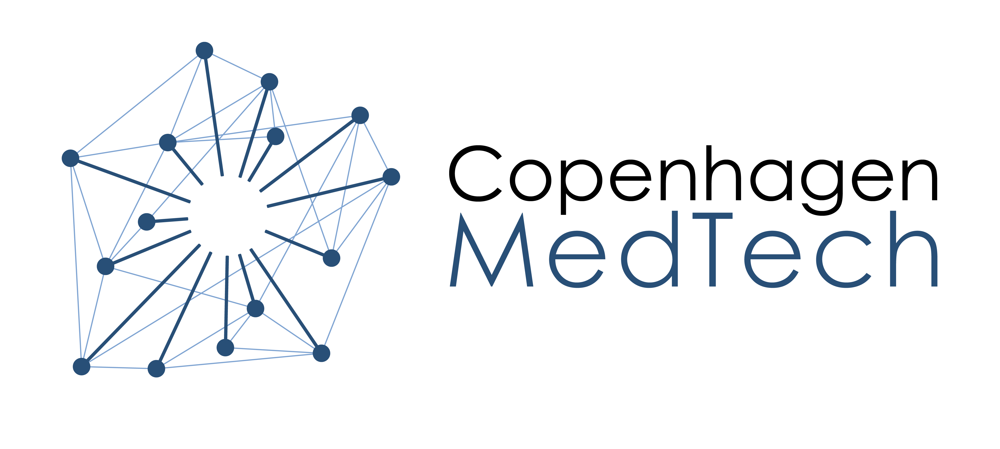

# Copenhagen Medtech X Google Cloud X BrainCapture Hackathon

   

## Introduction

Welcome to the BrainCapture EEG Analysis Hackathon! 

This hackathon challenges participants to leverage artificial intelligence techniques to enhance EEG analysis. BrainCapture utilizes an advanced transformer model to map segments of EEG data into a latent, high-dimensional space, encapsulating pertinent information within the EEG signals. Your task is to create a cloud pipeline for analyzing these latent representations.

## Scope of the hackathon

The aim of this hackathon is to develop a cloud-based pipeline for analyzing EEG data using artificial intelligence techniques. Specifically, participants are tasked with the following:

1. Import EEG sessions and segment them into smaller, relevant windows.
2. Transform these windows into latent representations.
3. Analyze the latent representations using a data analysis or machine learning pipeline.
4. Present the findings via a cloud-based platform.

## Approaches

The challenge can be approached in various ways. Some suggested approaches include:

- Implementing machine learning algorithms for EEG data analysis.
- Developing visualization techniques for exploring latent representations.
- Creating a web-based platform for interactive data exploration.

## Provided Materials

To aid participants in the hackathon, the following materials will be provided:

- Two EEG datasets (BC Bhutan and TUAR)
- A model for encoding EEG data into latent representations
- Sample code for simple learning algorithms (e.g., KNN) and EEG data visualizations
- Sample code for deploying a simple website
- A guide for deploying to the Google Cloud Platform

## Evaluation Criteria

Submissions will be evaluated based on the following criteria:

1. Technical ability and findings
2. Innovation and creativity
3. Utility for BrainCapture
4. Efficiency of the cloud deployment pipeline
5. Quality of the pitch

## Getting Started/Further Reading

For detailed instructions on setting up the project and accessing provided materials, refer to the [Getting Started Guide](docs/getting_started.md).

For deploying your solution to the Google Cloud Platform, follow the steps outlined in the [GCP Deployment Guide](docs/gcp_deployment.md).

## License

This project is licensed under the [LICENSE](LICENSE) file.
